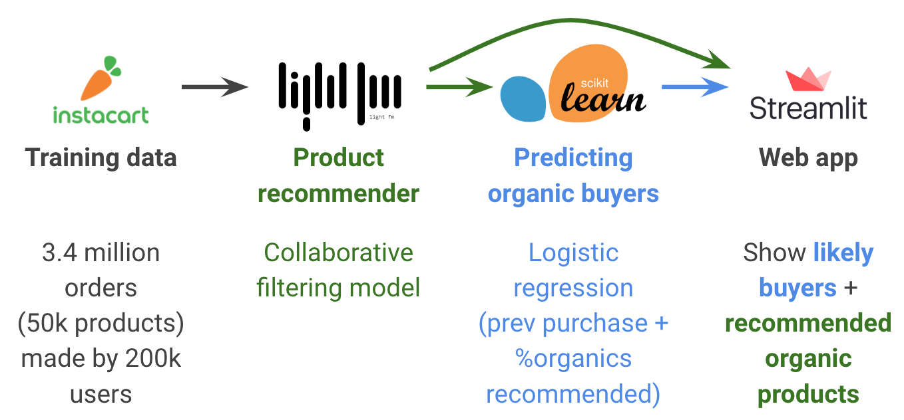

# Apples to Audiences: A tool for targeting organic produce buyers

This is the model development and streamlit app deployment for the [Insight Data Science](https://www.insightdatascience.com/) Project [Apples to Audiences](slides/ApplesToAudiences.pdf).

## Motivation 
Organic food is the fastest-growing category in retail grocery today, but still represents just 6% of the total market share in the U.S. To grow the market, organic trade associations provide coupons and other advertising to incentivize purchases, but currently such promotions are not targeted to individual consumers. 

Can likely organic buyers be identified in a way that grows organic sales? 

Apples to Audiences is a tool that identifies users who are likely to buy organic produce based on their past shopping history, combining recommendations from a collaborative filtering model with predictions from a logistic regression model. 

The model behind Apples to Audiences identifies 10% new likely buyers of organic food and reduces spam to unlikely buyers by 40% compared to not targeting. More focused targeting will increase lift in the percentage of purchases with organic items.

## Table of Contents

- [OrganicFoodBuyers](OrganicFoodBuyers/README.md)
	- Contains standalone code for the final model development pipeline
- [notebooks](notebooks/README.md)
	- Contains jupyter notebooks documenting different experimental pipelines for the project.
- [webapp_streamlit](webapp_streamlit/README.md)
	- Contains the streamlit front-end. See [Running Streamlit on EC2](#running-streamlit-on-ec2) for instructions for deploying on AWS.

## Instructions to run

Clone the repo:
```bash
git clone https://github.com/jeffcfho/OrganicFoodBuyers.git
```

Use either of the requirements files to install the necessary packages. Both have all the packages required for reproducibility but some packages are superfluous that have not yet been removed from the experimentation stage (see Issue #3).
```bash
conda create --name <env> --file conda_requirements.txt
```
OR
```bash
pip install -r pip_requirements.txt
```


## Tech stack and data sources

1. Pandas
2. LightFM
3. Scikit-learn
4. Streamlit
5. EC2



Data: [Instacart order data (3.4 million orders made by 200k users)](https://www.instacart.com/datasets/grocery-shopping-2017)

## Notes

### Pandas dataframe manipulations

The order data lives in several tables: `orders`, `products`, `orders_products__train`, and `orders_products__prior`.

#### Get product purchase frequency by user

```python
# Filter orders table to only get past orders
users_order_prior = orders.loc[orders['eval_set'].map(lambda x: x in ['prior'])]

# Join products in prior orders to the user for each order
user_order_products_prior = order_products__prior.merge(users_order_prior[['order_id','user_id']],
                                                        on='order_id')
# Check join worked
display(users_order_prior.loc[users_order_prior['order_id']==2]) # does this return user 202279?

# Group products ordered by user
user_products_freq_long = user_order_products_prior[['user_id','product_id']]\
							.groupby(['user_id','product_id']).size()

# Reset index to remove MultiIndex
user_products_freq_long = user_products_freq_long.reset_index()
user_products_freq_long.columns = ['user_id','product_id','freq']
display(user_products_freq_long.head(3))
# 		user_id	product_id	freq
# 	0	1		196			10
# 	1	1		10258		9
# 	2	1		10326		1
# 	...
```

#### Create user-product sparse matrix needed for LightFM

```python
# Row index of matrix will be user_id - 1 (because there is no user_id==0 but we have a row_ind = 0)
row_ind = user_products_freq_long['user_id'].values - 1
num_rows = max(user_products_freq_long['user_id'].unique())

# Column index of matrix will be prod_id - 1
col_ind = user_products_freq_long['product_id'].values - 1
num_cols = max(user_products_freq_long['product_id'].unique())

# Frequency data are cell values
freq = user_products_freq_long['freq'].values

# Create sparse matrix
user_prod_interaction_train = coo_matrix((freq, (row_ind, col_ind)), shape = (num_rows, num_cols))

user_prod_interaction_train
# <206209x49688 sparse matrix of type '<class 'numpy.int64'>'
#	with 13307953 stored elements in COOrdinate format>
```

### Visualizing classification trees

[pydotplus](https://pydotplus.readthedocs.io/reference.html#module-pydotplus.graphviz):

`pip install pydotplus`

```python
# Fit a tree from sklearn
from sklearn import tree
rt = tree.DecisionTreeClassifier(max_depth=2,random_state=0,criterion='entropy')
rt.fit(X_train,y_train)

# tree module has export_graphviz function whose output can be passed into pydotplus
dot_data = tree.export_graphviz(rt, out_file=None, 
                         feature_names=feature_cols,  
                         class_names=y_col,  
                         filled=True, rounded=True,  
                         special_characters=True)  
graph = pydotplus.graph_from_dot_data(dot_data) 

display(Image(graph.create_png()))
```

### Running Streamlit on EC2

[Instructions](https://blog.jcharistech.com/2019/10/29/how-to-deploy-streamlit-apps-on-aws-ec2/):

1. Set up EC2 instance and download pem file locally. 
2. SSH on to the instance: `ssh -i "YourPEMfile.pem" ec2-user@<Your Public DNS(IPv4) Address>`
3. Install Python 3 and git: `sudo yum install python36`, `sudo yum install git`
3. Install any necessary packages: `python36 -m pip install streamlit`, `python36 -m pip install plotly_express` and others as necessary
4. Clone the repo: git clone https://github.com/jeffcfho/OrganicFoodBuyers.git
5. Run the app: `streamlit run applestoaudiences.py`

If you want to have the app running while you exit your EC2 instance, use `tmux`:

1. `sudo yum install tmux`
2. `tmux new -s st_instance`
3. Inside the new window, run the app: `streamlit run applestoaudiences.py`
4. Hit `CTRL+B`, let go, then hit `D` to exit out of the window with the app still running.

### Domain name forwarding to your Streamlit-hosted EC2 instance

[Instructions](http://techgenix.com/namecheap-aws-ec2-linux/)

You may have to append `--server.enableCORS false` when you run your streamlit app, as per [this issue](https://discuss.streamlit.io/t/ec2-streamlit-stuck-on-loading-screen-while-running-streamlit-hello/276).
