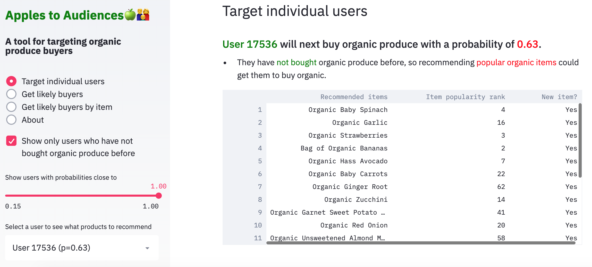

# Streamlit App

The [app](http://applestoaudiences.today) has 4 pages: 

1. Target Individual Users
2. Get Likely Buyers
3. Get Likely Buyers By Item
4. About

## Screenshots

### Target Individual Users
Default view is all users. If the user bought organic produce before, app recommends promoting new items.

If the box in the side panel is checked, ony users who have not bought organic produce before are surfaced. For these users, app recommends promoting the most popular items out of the recommmendations.

### Get Likely Buyers
Surfaces emails (made up for demonstration purchases) of likely buyers for targeting promotions (for the general Organic Trade Association user).

### Get Likely Buyers By Item
Surfaces likely buyer emails who were recommended a specific product (for the user who represents specific types of Organic Produce, e.g., Strawberries).

### About
Get general information about the app, plus the distribution of predicted probabilities showing user segments.

